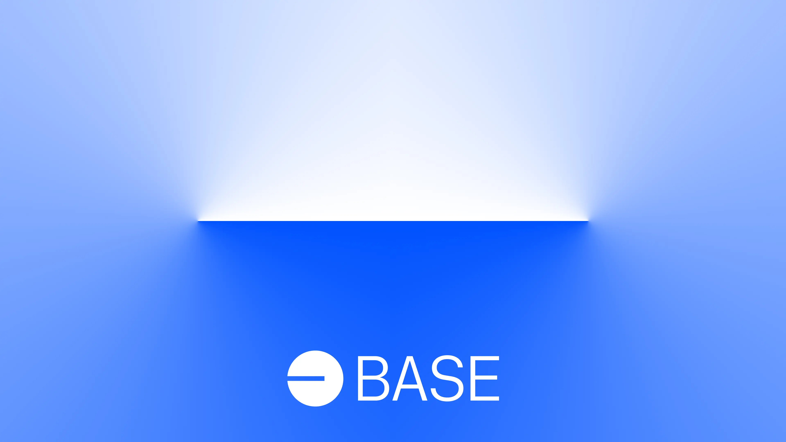

# Base node

Base is a secure, low-cost, developer-friendly Ethereum L2 built to bring the next billion users onchain. It's built on Optimism's open-source [OP Stack](https://stack.optimism.io/).

This repository contains the relevant Docker builds to run your own node on the Base network.

<!-- Badge row 1 - status -->

[](https://github.com/base/node/graphs/contributors)
[](https://github.com/base/node/graphs/commit-activity)
[](https://github.com/base/node/stargazers)

[](https://github.com/base/node/blob/main/LICENSE)

<!-- Badge row 2 - links and profiles -->

[](https://base.org)
[](https://base.mirror.xyz/)
[](https://docs.base.org/)
[](https://base.org/discord)
[](https://x.com/Base)

<!-- Badge row 3 - detailed status -->

[](https://github.com/base/node/pulls)
[](https://github.com/base/node/issues)

### Hardware requirements

We recommend you have this hardware configuration to run a node:

- a modern multi-core CPU with good single-core performance
- at least 16 GB RAM (32 GB recommended)
- a locally attached NVMe SSD drive
- adequate storage capacity to accommodate both the snapshot restoration process (if restoring from snapshot) and chain data, ensuring a minimum of (2 \* current_chain_size) + snapshot_size + 20%\_buffer

**Note:** If utilizing Amazon Elastic Block Store (EBS), ensure timing buffered disk reads are fast enough in order to avoid latency issues alongside the rate of new blocks added to Base during the initial synchronization process; `io2 block express` is recommended.

### Troubleshooting

If you encounter problems with your node, please open a [GitHub issue](https://github.com/base/node/issues/new/choose) or reach out on our [Discord](https://discord.gg/buildonbase):

- Once you've joined, in the Discord app go to `server menu` > `Linked Roles` > `connect GitHub` and connect your GitHub account so you can gain access to our developer channels
- Report your issue in `#🛟|developer-support` or `🛠｜node-operators`

### Supported networks

| Base Network      | Status |
|-------------------| ------ |
| Testnet (Sepolia) | ✅     |
| Mainnet           | ✅     |

### Usage

1. Ensure you have an Ethereum L1 full node RPC available (not Base), and set `OP_NODE_L1_ETH_RPC` (in the `.env.*` file if using docker-compose). If running your own L1 node, it needs to be synced before Base will be able to fully sync.
2. Set the `NETWORK_ENV` environment variable to specify your network:
   ```bash
   # For mainnet:
   export NETWORK_ENV=.env.mainnet
   # For testnet:
   export NETWORK_ENV=.env.sepolia
   ```
3. Run:

```
docker compose up --build
```

> [!NOTE]
> To run the node using a supported client, you can use the following command:
> `CLIENT=supported_client docker compose up --build`
> 
> Supported clients:
> - geth
> - reth
> - nethermind

4. You should now be able to `curl` your Base node:

```
curl -d '{"id":0,"jsonrpc":"2.0","method":"eth_getBlockByNumber","params":["latest",false]}' \
  -H "Content-Type: application/json" http://localhost:8545
```

Note: Some L1 nodes (e.g. Erigon) do not support fetching storage proofs. You can work around this by specifying `--l1.trustrpc` when starting op-node (add it in `op-node-entrypoint` and rebuild the docker image with `docker compose build`.) Do not do this unless you fully trust the L1 node provider.

#### Persisting Data

By default, the data directory is stored in `${PROJECT_ROOT}/geth-data`. You can override this by modifying the value of
`GETH_HOST_DATA_DIR` variable in the [`.env`](./.env) file.

To load a [snapshot](#snapshots) you can extract the snapshot into the `$GETH_HOST_DATA_DIR` folder.

#### Running in single container with `supervisord`

If you'd like to run the node in a single container instead of `docker-compose`, you can use the `supervisord` entrypoint.
This is useful for running the node in a Kubernetes cluster, for example.

Note that you'll need to override some of the default configuration that assumes a multi-container environment (`OP_NODE_L2_ENGINE_RPC`) and any port conflicts (`OP_NODE_RPC_PORT`).
Example:

```
docker run --env-file .env.sepolia -e OP_NODE_L2_ENGINE_RPC=ws://localhost:8551 -e OP_NODE_RPC_PORT=7545 ghcr.io/base/node:latest
```

### Snapshots

You can fetch the latest snapshots via the URLs provided in the [Base docs](https://docs.base.org/guides/run-a-base-node/#snapshots).

### Syncing

Sync speed depends on your L1 node, as the majority of the chain is derived from data submitted to the L1. You can check your syncing status using the `optimism_syncStatus` RPC on the `op-node` container. Example:

```
command -v jq  &> /dev/null || { echo "jq is not installed" 1>&2 ; }
echo Latest synced block behind by: \
$((($( date +%s )-\
$( curl -s -d '{"id":0,"jsonrpc":"2.0","method":"optimism_syncStatus"}' -H "Content-Type: application/json" http://localhost:7545 |
   jq -r .result.unsafe_l2.timestamp))/60)) minutes
```

## Disclaimer

We're excited for you to build on Base 🔵 — but we want to make sure that you understand the nature of the node software and smart contracts offered here.

THE NODE SOFTWARE AND SMART CONTRACTS CONTAINED HEREIN ARE FURNISHED AS IS, WHERE IS, WITH ALL FAULTS AND WITHOUT WARRANTY OF ANY KIND, EXPRESS OR IMPLIED, INCLUDING ANY WARRANTY OF MERCHANTABILITY, NON-INFRINGEMENT, OR FITNESS FOR ANY PARTICULAR PURPOSE. IN PARTICULAR, THERE IS NO REPRESENTATION OR WARRANTY THAT THE NODE SOFTWARE AND SMART CONTRACTS WILL PROTECT YOUR ASSETS — OR THE ASSETS OF THE USERS OF YOUR APPLICATION — FROM THEFT, HACKING, CYBER ATTACK, OR OTHER FORM OF LOSS OR DEVALUATION.

You also understand that using the node software and smart contracts are subject to applicable law, including without limitation, any applicable anti-money laundering laws, anti-terrorism laws, export control laws, end user restrictions, privacy laws, or economic sanctions laws/regulations.
